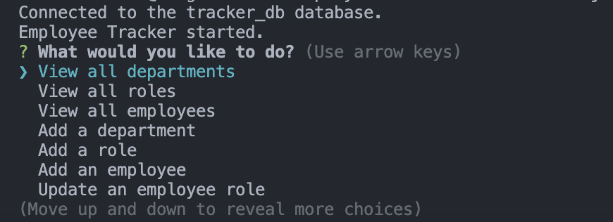

# Employee Tracker

## Description
A CLI application that allows you to create an employee tracker system. You can view and edit employee roles, names, departments, and managers. Upon running application, run a npm i to install required dependencies for the application.

## Usage

[Employee Tracker Demo](https://youtu.be/LAkmNQ28iFc)
## Languages and Tools Used
* 
* 
* 
* 
* 
* 
* Inquirer

## Credits
Pengteda Cheng 
* 
* 
* [Markdown Badges](https://github.com/Ileriayo/markdown-badges)